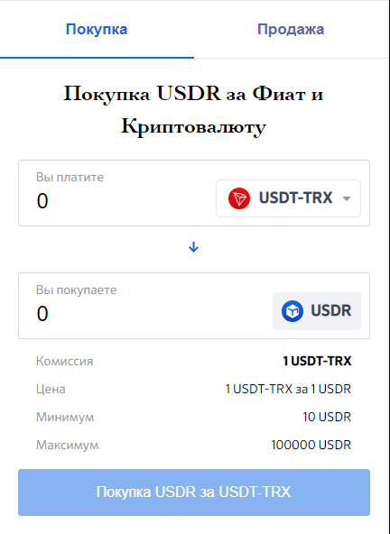

# Widget Finance



## Install 

Just include tags in any part of html page

```
<finance-widget api-key="RELICTUM_FINANCE" type="widget"></finance-widget>
<script src="https://scriptpath"></script>
```

## Options

- `api-key`: your relictum finance widget api key
- `type`: widget including type, have two parametres - `widget` and `modal`
- `lang`: widget language `ru`, `en`, `vi`, `ab`, `in`